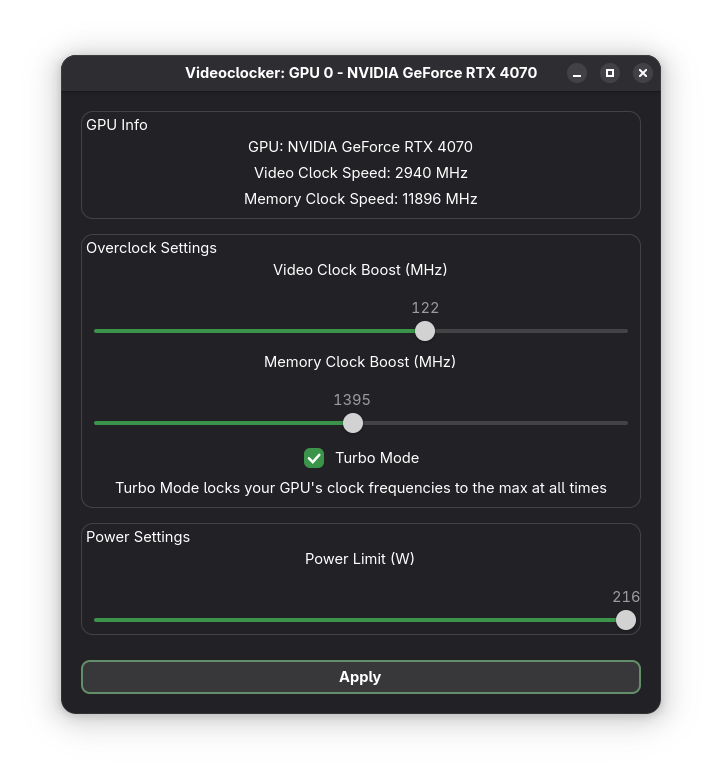

# Videoclocker  
A GTK app for easily overclocking NVIDIA GPUs.  

## Features  
- Clock speed monitor  
- Boost/lower max GPU and VRAM clock speeds  
- Turbo mode: lock clock speeds to 100% at all times and disable frequency scaling  
- Power limit: set GPU power limit  
## Planned Features
- Fan control  
- Temperature monitor  
- Profiles  
- Apply on startup
- Voltage controls  
## Building  
Install requirements: `pip install -r requirements.txt`  
Install pyinstaller: `pip install pyinstaller`  
Build executable: `pyinstaller main.spec`  
The application will end up in `dist/main`